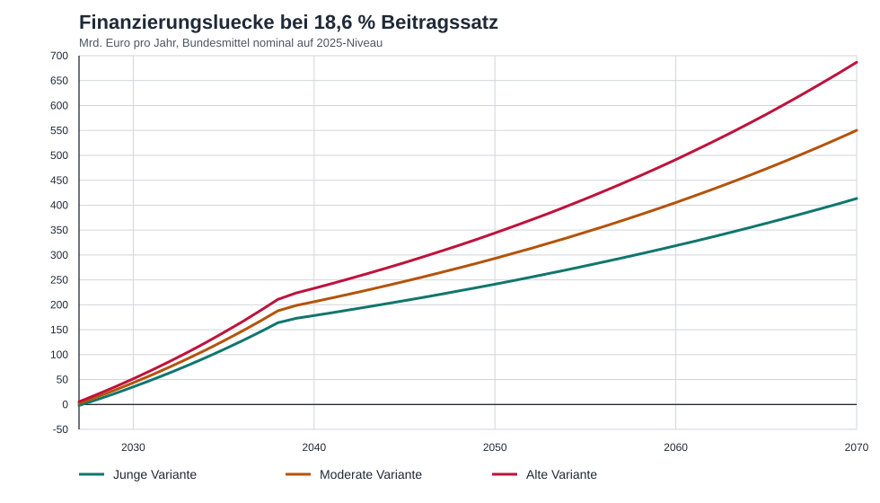
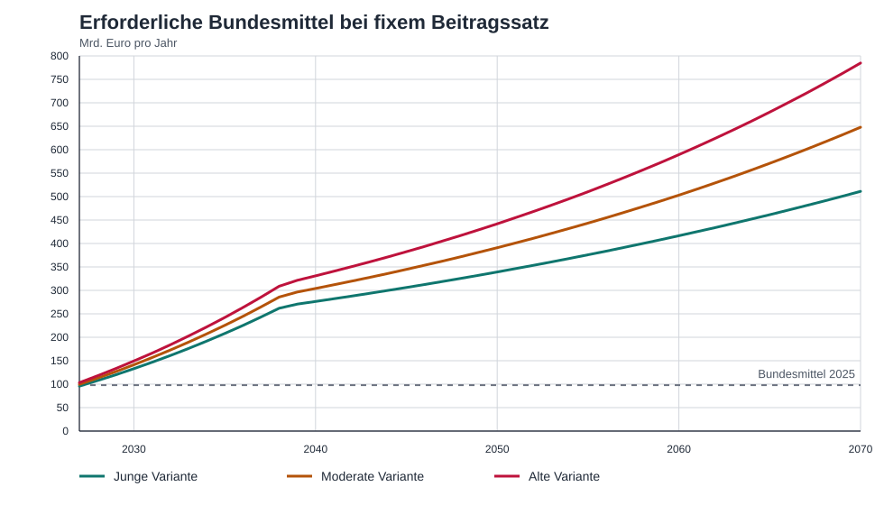

# Rentenproblem in Deutschland - Ursachen und Auswirkungen ohne Gegenmassnahmen

## Leitfrage

Worin besteht das Rentenproblem der gesetzlichen Rentenversicherung in
Deutschland, welche Ursachen treiben es, und welche Auswirkungen sind zu
erwarten, wenn keine wirksamen Gegenmassnahmen ergriffen werden?

## Kurzfassung

Das Rentenproblem ist kein einzelnes Kassenloch, sondern ein struktureller
Verteilungskonflikt im Umlagesystem: Eine wachsende Zahl alter Menschen trifft
auf eine relativ kleinere Beitragsbasis. Destatis weist fuer 2024 einen
Altenquotienten von 33 Personen ab 67 Jahren je 100 Personen im Alter 20 bis
66 aus; bis 2038 steigt er je nach Variante auf 43 bis 47 und bis 2070 auf 43
bis 61. Damit verschiebt sich die Finanzierungslast dauerhaft auf
Beitragssatz, Bundeshaushalt, Rentenniveau oder Verschuldung.

Der amtliche Rentenversicherungsbericht 2025 zeigt den Druck bereits bis 2039:
In der mittleren Variante steigt der Beitragssatz der allgemeinen
Rentenversicherung von 18,6 % bis 2027 auf 21,2 % im Jahr 2039. Das lokale
Langfristmodell im Repo schreibt den Status quo in einem moderaten Szenario
bis 2070 auf 26,1 % fort; unguenstigere Demographie und nicht verbreiterte
Beitragsbasis fuehren zu deutlich hoeheren Saetzen. Ohne Gegenmassnahmen wird
die Rente deshalb nicht schlagartig insolvent, aber die Kosten werden immer
sichtbarer zwischen Arbeitnehmern, Arbeitgebern, Steuerzahlern, Rentnern und
anderen Staatsaufgaben verteilt.

## Begriff und Abgrenzung

`Rentenproblem` meint hier die dauerhafte Finanzierungs- und
Verteilungsbelastung der gesetzlichen Rentenversicherung. Davon zu trennen
sind vier Teilprobleme:

- Demographische Last: Mehr Rentenalter pro Erwerbsalter im Umlageverfahren.
- Finanzierungsproblem: Beitragseinnahmen, Bundesmittel und Ruecklage muessen
  steigende Ausgaben decken.
- Leistungsproblem: Das Sicherungsniveau soll politisch stabil bleiben,
  waehrend die Finanzierungsbasis unter Druck geraet.
- Transparenzproblem: Versicherungsleistungen, staatlich gewollte
  Umverteilung und Bundeszuschuesse sind nicht trennscharf sichtbar.

Keine dieser Ebenen ist allein das ganze Problem. Eine Analyse, die nur auf
Beitragssaetze schaut, unterschlaegt den Bundeshaushalt. Eine Analyse, die nur
auf Bundeszuschuesse schaut, unterschlaegt Demographie und Rentenniveau.

## Datenlage

Die belastbarsten Quellen fuer diese Analyse sind amtliche oder primaere
Quellen:

- Destatis liefert die demographische Basis bis 2070, insbesondere
  Altersstruktur, Erwerbsalter und Altenquotient.
- Der Rentenversicherungsbericht 2025 liefert die amtliche
  Status-quo-Vorausberechnung bis 2039.
- DRV-Finanzkennzahlen liefern Einnahmen, Ausgaben, Bundesmittel,
  Rentenausgaben und Nachhaltigkeitsruecklage.
- DRV-rentenupdate und Bundestagsdrucksache 21/1419 begrenzen die Aussagekraft
  zur Zweckzerlegung der Bundesmittel: Fuer 2023 gibt es eine oeffentliche
  DRV-Schaetzung; fuer 2024 bis 2026 bestaetigt die Bundesregierung fehlende
  entsprechende Zahlen beziehungsweise Berechnungen.

Die Statista-Infografik ist nur eine sekundaere Visualisierungsquelle. Sie
nennt aktuell rechnerisch 2,1 Beitragszahler je Altersrentner und verweist auf
eine langfristige Verschlechterung der Relation. Fuer harte Modellierung
bleiben DRV-Primärdaten vorrangig, weil der direkte Statista-Abruf im Repo nur
eingeschraenkt verifizierbar war.

## Entwicklung und Trends

Die zentrale Entwicklung ist die Alterung der Bevoelkerung. 2024 lebten in
Deutschland 83.577.140 Menschen; die Gruppe 20 bis 66 Jahre bildet die
potenzielle Beitragsbasis, die Gruppe ab 67 die rentennahe und rentenbezogene
Lastseite. Destatis erwartet in allen Varianten, dass 2035 rund ein Viertel
der Bevoelkerung 67 Jahre oder aelter ist.

Der Altenquotient steigt von 33 im Jahr 2024 auf 43 bis 47 im Jahr 2038. Das
entspricht gegenueber 2024 einer Belastungszunahme von rund 30 % bis 42 %. Bis
2070 reicht die Bandbreite von 43 bis 61; im unguenstigen Szenario waere der
Altenquotient damit rund 85 % hoeher als 2024. Parallel sinkt die
Erwerbsbevoelkerung im Langfristvergleich je nach Variante deutlich.

Der finanzielle Trend folgt daraus nicht mechanisch eins zu eins, aber die
Richtung ist stabil: Wenn Rentenansprueche, Rentenniveau und
Renteneintrittsverhalten weitgehend konstant bleiben, muessen steigende
Ausgaben ueber hoehere Beitraege, hoehere Bundesmittel, geringere Leistungen
oder andere Finanzierungsquellen getragen werden.

## Ursachen und Treiber

Die wichtigste Ursache ist das Umlageprinzip unter demographischer Alterung.
Aktuelle Beitragszahler finanzieren aktuelle Renten. Wenn das Verhaeltnis von
Beitragszahlern zu Rentnern sinkt, steigt die Belastung pro Beitragszahler,
sofern die Leistungen nicht entsprechend angepasst werden.

Zweiter Treiber ist der Babyboomer-Uebergang in den Ruhestand. Die starke
Geburtsjahrgangsgruppe verlaesst bis Ende der 2030er-Jahre das Erwerbsalter
und wechselt in den Rentenbezug. Dadurch steigt der Druck gerade in dem
Zeitraum, den der Rentenversicherungsbericht 2025 bis 2039 abdeckt.

Dritter Treiber ist die begrenzte Beitragsbasis. Die gesetzliche Rente
finanziert sich vor allem aus sozialversicherungspflichtigen Arbeitseinkommen
bis zur Beitragsbemessungsgrenze. Nicht jede Erwerbstaetigkeit und nicht jede
Einkommensart traegt gleich zur Finanzierung bei. Eine schrumpfende oder nur
langsam wachsende beitragspflichtige Lohnsumme verschaerft den Konflikt.

Vierter Treiber ist die Vermischung von Versicherungslogik und
gesamtgesellschaftlichen Aufgaben. Fuer 2023 schaetzt die DRV nicht
beitragsgedeckte Leistungen auf 124,1 Mrd. Euro bei Bundeszuschuessen von
84,3 Mrd. Euro. Die Bundesregierung bestaetigt zugleich, dass fuer 2024 bis
2026 keine entsprechenden oeffentlichen Zahlen beziehungsweise Berechnungen
vorliegen. Damit bleibt politisch schwer sichtbar, welcher Teil der
Rentenfinanzierung beitragsaequivalent, welcher sozialpolitisch und welcher
haushaltspolitisch getrieben ist.

## Auswirkungen ohne Gegenmassnahmen

Ohne Gegenmassnahmen steigt zunaechst der Beitragssatzdruck. Amtlich reicht
die mittlere Vorausberechnung bis 2039 und nennt dort 21,2 %. Das lokale
Langfristmodell kommt im moderaten Status-quo-Szenario bis 2070 auf 26,1 %.
In unguenstigeren Szenarien oder bei zusaetzlichen Leistungsversprechen ohne
neue Finanzierungsbasis steigen die Beitragssaetze weiter.

Hoehere Beitragssaetze verteuern Arbeit und senken die Nettolohndynamik der
Beschaeftigten. Arbeitgeber tragen formal die Haelfte des Beitragssatzes,
aber oekonomisch wirkt ein steigender Sozialbeitrag als Belastung der
Arbeitskosten und der verfuegbaren Arbeitseinkommen. Besonders spuerbar ist
das fuer mittlere und niedrige Einkommen, weil Sozialbeitraege nicht progressiv
wie die Einkommensteuer wirken.

Parallel steigt der Druck auf den Bundeshaushalt. Schon heute sind
Bundesmittel eine zentrale Einnahmequelle der Rentenversicherung. Wenn der
Bund hoehere Zuschuesse leistet, konkurriert die Rente staerker mit Bildung,
Infrastruktur, Verteidigung, Investitionen, Klimaanpassung und
Schuldendienst. Werden Bundesmittel nicht erhoeht, verlagert sich der Druck
zurueck auf Beitraege, Rentenanpassung oder Ruecklagen.

Auch das Rentenniveau geraet unter politischen Druck. Wenn Beitragssaetze und
Bundesmittel begrenzt bleiben sollen, werden geringere Rentenanpassungen,
spaeterer Renteneintritt oder staerkere private und betriebliche Vorsorge
wahrscheinlicher. Ohne klare Gegenmassnahmen entsteht dadurch Unsicherheit,
ob kuenftige Renten im Alter ausreichenden Lebensstandard sichern.

Die Nachhaltigkeitsruecklage kann kurzfristige Schwankungen puffern, loest
aber kein strukturelles Demographieproblem. Wenn laufende Ausgaben dauerhaft
schneller wachsen als tragfaehige Einnahmen, ist die Ruecklage nur ein
Uebergangsinstrument.

Gesellschaftlich droht ein Verteilungskonflikt zwischen Generationen und
Gruppen. Rentner wollen verlaessliche Ansprueche, Beitragszahler tragbare
Abgaben, Arbeitgeber wettbewerbsfaehige Arbeitskosten und der Bund
haushaltspolitischen Spielraum. Ohne geklaerte Lastverteilung nimmt die Rente
mehr Raum in allgemeinen Verteilungskonflikten ein.

## Eigene Hochrechnung: Finanzierungsluecke bei fixem Beitragssatz

Reproduzierbar mit:

```bash
python3 scripts/calc_rentenproblem_finanzierungsluecke.py
```

Diese Hochrechnung isoliert die Frage des Nutzers: Was passiert, wenn der
Beitragssatz bei 18,6 % bleibt und das Renteneintrittsalter nicht angehoben
wird? Modelliert werden drei Destatis-nahe Demographiepfade aus der
bestehenden Repo-Logik: `jung`, `moderat` und `alt`. Die Altersgrenze bleibt
bei 67; die Lastseite ist damit die Bevoelkerung ab 67 Jahren, die
Beitragsseite die Bevoelkerung von 20 bis 66 Jahren.

Die Rechnung ist nominal, nicht preisbereinigt. Die Beitragsbasis waechst mit
2,5 % nominalem Lohnwachstum und wird anschliessend mit der jeweiligen
Erwerbsalter-Entwicklung skaliert. Die Rentenausgaben wachsen bis 2039 mit
2,8 % pro Jahr und danach mit 2,3 %; zusaetzlich werden sie mit der Zahl der
Personen ab 67 skaliert. Die Bundesmittel werden in der Lueckenrechnung
nominal auf dem 2025er Niveau von 97,858 Mrd. Euro gehalten. Die Ausgaben sind
wie im bestehenden Zukunftsmodell auf die moderate 2027er BMAS-Plausibilitaet
kalibriert.

Die Finanzierungsluecke ist definiert als:

```text
Ausgaben
- Beitragseinnahmen bei 18,6 %
- Bundesmittel 2025 nominal konstant
- sonstige Einnahmen
= Finanzierungsluecke
```



| Szenario | 2027 | 2035 | 2039 | 2050 | 2070 |
| --- | ---: | ---: | ---: | ---: | ---: |
| jung | -2,1 Mrd. Euro | 110,2 Mrd. Euro | 172,9 Mrd. Euro | 241,4 Mrd. Euro | 413,3 Mrd. Euro |
| moderat | 1,7 Mrd. Euro | 127,6 Mrd. Euro | 198,7 Mrd. Euro | 293,1 Mrd. Euro | 550,1 Mrd. Euro |
| alt | 5,4 Mrd. Euro | 144,3 Mrd. Euro | 223,6 Mrd. Euro | 344,1 Mrd. Euro | 686,9 Mrd. Euro |

Interpretation: Schon im moderaten Szenario entsteht bis 2035 ein
zusaetzlicher jaehrlicher Finanzierungsbedarf von rund 128 Mrd. Euro. Bis 2039
liegt die Luecke bei rund 199 Mrd. Euro, bis 2070 bei rund 550 Mrd. Euro. In
der alten Variante waere die Luecke 2070 mit rund 687 Mrd. Euro deutlich
groesser. Die junge Variante entschaerft den Pfad, beseitigt ihn aber nicht.

Dass die junge Variante 2027 rechnerisch mit -2,1 Mrd. Euro knapp keinen
Fehlbetrag ausweist, ist kein struktureller Ueberschuss. Es entsteht aus der
Kalibrierung auf 2027 und verschwindet unmittelbar danach; ab 2030 zeigt auch
die junge Variante eine positive Luecke.

Die gleiche Rechnung laesst sich als erforderlicher Bundesmittelbedarf lesen:
Wenn der Beitragssatz bei 18,6 % bleibt, muesste der Bund den nicht durch
Beitraege und sonstige Einnahmen gedeckten Betrag tragen.



| Szenario | Erforderliche Bundesmittel 2035 | 2039 | 2050 | 2070 |
| --- | ---: | ---: | ---: | ---: |
| jung | 208,1 Mrd. Euro | 270,8 Mrd. Euro | 339,3 Mrd. Euro | 511,2 Mrd. Euro |
| moderat | 225,5 Mrd. Euro | 296,6 Mrd. Euro | 391,0 Mrd. Euro | 648,0 Mrd. Euro |
| alt | 242,1 Mrd. Euro | 321,5 Mrd. Euro | 442,0 Mrd. Euro | 784,8 Mrd. Euro |

Das ist keine Prognose fuer tatsaechliche Bundeszuschuesse, sondern eine
Lueckenrechnung: Sie zeigt, welcher Betrag bei konstantem Beitragssatz und
unveraenderter Altersgrenze anderswo herkommen muesste. Alternativ zur
Bundesfinanzierung entspraeche die moderate Luecke 2039 rund 9,0
zusaetzlichen Beitragssatzpunkten und 2070 rund 13,0 Punkten. In der alten
Variante waeren es 2070 rund 18,1 Punkte. Diese Umrechnung ist nur eine
Groessenordnung, weil der Nutzerfall gerade konstante Beitraege unterstellt.

Artefakte:

- Jahreswerte:
  `analysen/daten/2026-06-05-rentenproblem-finanzierungsluecke.csv`
- Annahmen:
  `analysen/daten/2026-06-05-rentenproblem-finanzierungsluecke-annahmen.csv`
- Diagramme:
  `analysen/diagramme/2026-06-05-rentenproblem-finanzierungsluecke.svg`,
  `analysen/diagramme/2026-06-05-rentenproblem-bundesmittelbedarf.svg`
- Skript:
  `scripts/calc_rentenproblem_finanzierungsluecke.py`

## Betroffene Gruppen und Akteure

Beschaeftigte tragen steigende Beitraege unmittelbar ueber geringere
Nettolohnspielraeume. Arbeitgeber sind ueber Lohnnebenkosten betroffen.
Rentnerinnen und Rentner sind betroffen, wenn Anpassungen, Niveau oder
Zuschuesse politisch begrenzt werden. Junge und kuenftige Erwerbstaetige
tragen die laengste kumulierte Last, weil die demographische Verschiebung bis
2070 reicht.

Der Bund ist nicht nur Aufsicht und Gesetzgeber, sondern ueber Bundesmittel
Mitfinanzierer. Dadurch wird das Rentenproblem zugleich ein
Bundeshaushaltsproblem. Die Deutsche Rentenversicherung muss die operative
Zahlungsfaehigkeit sicherstellen, kann die grossen Stellgroessen aber nur im
Rahmen politischer Vorgaben umsetzen.

## Quellenlage und Belastbarkeit

Die demographische Diagnose ist hoch belastbar, weil mehrere Varianten zwar
unterschiedliche Niveaus, aber dieselbe Grundrichtung zeigen: Der
Altenquotient steigt. Die amtliche Rentenvorausberechnung bis 2039 ist ein
belastbarer Status-quo-Anker, aber keine Langfristprognose bis 2070.

Das lokale Modell bis 2070 ist ein Arbeitsmodell und daher niedriger zu
gewichten als amtliche Quellen. Es ist trotzdem nuetzlich, weil es die
Konsequenz der Destatis-Varianten ueber den BMAS-Horizont hinaus sichtbar
macht und die Zahlen reproduzierbar unter `scripts/` und `analysen/daten/`
ablegt.

Die neue Lueckenrechnung erhoeht die Anschaulichkeit, aber nicht die amtliche
Belastbarkeit der Langfristwerte. Sie ist eine Szenario- und
Sensitivitaetsrechnung: Beitragssatz und Altersgrenze werden festgehalten,
waehrend Demographie, Lohnbasis und Rentenausgaben fortgeschrieben werden.
Sie ersetzt keine vollstaendige Rentenzugangs-, Bestands- und
Sterblichkeitsmodellierung.

Die Bundesmittel-Zweckzerlegung bleibt nur teilweise belastbar. Fuer 2023
liegt eine oeffentliche DRV-Schaetzung vor; fuer 2024 bis 2026 fehlen nach
Bundestagsdrucksache 21/1419 entsprechende oeffentliche Zahlen oder
Berechnungen. Aussagen ueber Zweckanteile in diesen Jahren muessen deshalb
als Modellannahme markiert werden.

## Unsicherheiten und Widersprueche

Unsicher ist nicht, ob die Alterung Druck erzeugt, sondern wie stark einzelne
Entlastungsfaktoren wirken: Nettozuwanderung, Erwerbsbeteiligung von Frauen
und Aelteren, Produktivitaet, Lohnentwicklung, Arbeitslosigkeit,
Gesundheitszustand im Alter und Renteneintrittsverhalten.

Ein zweiter Unsicherheitsblock betrifft Definitionen. `Beitragszahler je
Altersrentner`, `Altenquotient`, `Rentner`, `Rentenbestand` und
`Versicherte` sind nicht deckungsgleich. Visualisierungen wie Statista sind
fuer den Problemaufriss hilfreich, duerfen aber nicht ohne Primärdaten in
Modellzahlen uebersetzt werden.

Ein dritter Unsicherheitsblock betrifft Politik. Gesetzliche Haltelinien,
Bundeszuschuesse, Beitragssatzregeln und Renteneintrittsalter koennen
geaendert werden. Die Frage `ohne Massnahmen` ist deshalb analytisch als
Fortschreibung geltender beziehungsweise bereits beruecksichtigter Regeln zu
lesen, nicht als echte politische Nullwelt.

## Offene Fragen

- Welche DRV-Primärzeitreihe bildet die Statista-Relation der Beitragszahler
  je Altersrentner exakt ab?
- Wie laesst sich der Rentenversicherungsbericht 2025 tabellarisch als CSV
  erfassen, um die amtliche 2039-Vorausberechnung direkt gegen lokale Modelle
  zu spiegeln?
- Wird der BMAS/DRV-Bericht an den Haushaltsausschuss vom 27. Februar 2025
  oeffentlich zugaenglich, und enthaelt er eine detailliertere
  Zweckzerlegung nicht beitragsgedeckter Leistungen?
- Welche Sensitivitaeten fuer Erwerbsquote, Migration und Produktivitaet
  sollen im Langfristmodell als naechste Stufe gerechnet werden?

## Moegliche Folgearbeiten

- DRV-Primärdaten zu Beitragszahlern und Altersrentnern als eigenen Ingest
  erfassen und die Statista-Relation verifizieren.
- Tabellen des Rentenversicherungsberichts 2025 als strukturierte Daten unter
  `analysen/daten/` ablegen.
- Langfristmodell um Sensitivitaeten fuer Erwerbsquote, Migration,
  Produktivitaet und Renteneintritt erweitern.
- Separat analysieren, wie sich das Rentenproblem mit GKV- und
  Pflegeversicherungsdruck ueberlagert.
